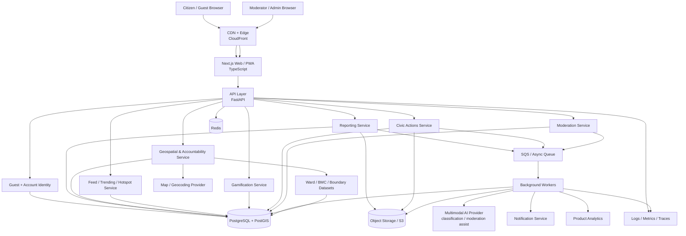
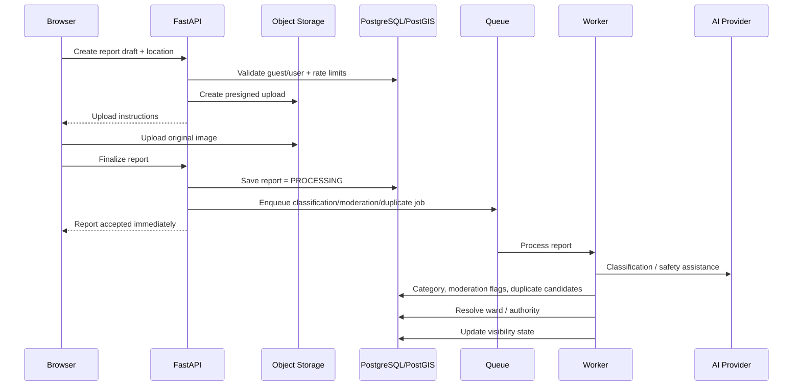
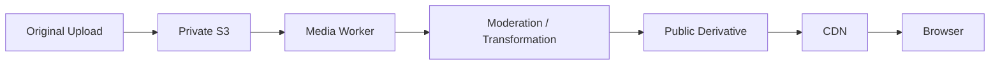

# CivicQuest High-Level Architecture

## 1. Architecture goals

The Phase 1 architecture should optimize for:

- fast web rollout,
- mobile-browser usability,
- geospatial correctness,
- cheap early-stage operation,
- strong moderation boundaries,
- asynchronous processing for expensive work,
- clean provider abstraction,
- future migration to native clients without rebuilding the backend.

## 2. Recommended architecture



## 3. Logical service boundaries

Start as a **modular monolith**, not many independently deployed microservices.

Recommended modules inside one FastAPI application:

```text
identity/
reports/
media/
geospatial/
accountability/
feed/
hotspots/
gamification/
civicdex/
quests/
civic_actions/
moderation/
notifications/
admin/
analytics/
```

Why modular monolith first:

- faster local development,
- fewer deployment components,
- simpler transactions,
- lower infrastructure cost,
- easier open-source contribution,
- service boundaries remain explicit enough to split later.

Split a module into an independent service only when load, ownership, or operational isolation demands it.

## 4. Primary request flow: report submission



The user should not wait for heavy AI work before receiving a successful submission response.

## 5. Media architecture

Store two classes of media.

### Private original
- original image/video,
- never served from a public bucket,
- access through signed URLs,
- restricted to authorized moderation/operations roles,
- configurable retention policy.

### Public derivative
- resized,
- metadata stripped,
- optionally blurred/redacted depending on product policy,
- optimized WebP/AVIF/JPEG,
- served via CDN.



## 6. Geospatial architecture

PostGIS is a core dependency.

Use it for:

- point-in-polygon ward lookup,
- radius searches,
- hotspot clustering,
- nearby issues,
- civic-action proximity,
- administrative-area ownership.

Example lookup:

```sql
SELECT a.id, a.name
FROM administrative_areas a
WHERE ST_Contains(a.boundary, ST_SetSRID(ST_Point(:lng, :lat), 4326))
ORDER BY a.level DESC
LIMIT 1;
```

## 7. Hotspot pipeline

V1 does not need complex ML clustering.

Start with deterministic rules:

1. reports within a configurable radius,
2. same/similar category,
3. open/unresolved,
4. within a recent time window,
5. enough unique reporters/upvotes.

Later add density clustering (DBSCAN/HDBSCAN) or grid-based bucketing.

## 8. AI usage

AI should assist, not decide irreversible outcomes.

Good Phase 1 uses:

- category suggestion,
- severity suggestion,
- duplicate assistance,
- moderation assistance,
- before/after difference assistance,
- share-card copy.

Do not use AI in Phase 1 for:

- identifying a real person,
- automatic fines,
- automatic public accusation,
- irreversible moderation with no review path.

Keep AI behind a provider interface.

## 9. Admin / moderator architecture

Admin UI can be a protected route in the same Next.js app initially.

Required moderator views:

- pending reports,
- flagged media,
- duplicate candidates,
- appeals,
- civic-action proof,
- user/report abuse,
- authority mapping corrections.

## 10. Scaling path

### 0–10k MAU
- one API deployment,
- one worker service,
- PostgreSQL/PostGIS,
- Redis,
- S3,
- SQS.

### 10k–100k MAU
- API autoscaling,
- worker autoscaling,
- read replica if needed,
- hotspot precomputation,
- CDN-heavy media delivery,
- partitioned analytics events.

### 100k+ MAU
Consider extracting:
- feed/hotspot ranking,
- media/moderation pipeline,
- notifications,
- analytics pipeline.
