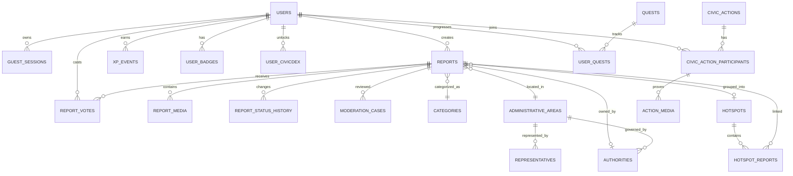

# CivicQuest Data Model & Schema

## 1. Design principles

- PostgreSQL is the system of record.
- PostGIS handles spatial relationships.
- XP is a ledger, not just a mutable integer.
- Report status history is append-only.
- Original evidence and public media are separate.
- Guest identities can later be linked to registered users.
- Accountability data is versioned because ward/representative ownership can change.

## 2. Core ER diagram

## 3. Users

### `users`

| Column | Type | Notes |
|---|---|---|
| id | UUID PK | Stable internal identity |
| identity_type | enum | guest, registered, moderator, admin |
| public_handle | varchar nullable | e.g. MumbaiNagrik |
| display_name | varchar nullable | public profile |
| email | citext nullable | private |
| phone | varchar nullable | private |
| auth_provider | varchar nullable | google/apple/etc |
| auth_subject | varchar nullable | provider ID |
| home_area_id | UUID nullable | preferred locality |
| xp_total_cached | bigint | derived/cache only |
| level_cached | int | derived/cache only |
| credibility_score | numeric | default neutral |
| status | enum | active/suspended/deleted |
| created_at | timestamptz | |
| updated_at | timestamptz | |

Unique:
- `(auth_provider, auth_subject)`
- `public_handle` when present

### `guest_sessions`

| Column | Type |
|---|---|
| id | UUID PK |
| user_id | UUID FK |
| session_token_hash | text |
| device_fingerprint_hash | text nullable |
| expires_at | timestamptz |
| created_at | timestamptz |

Do not store raw fingerprinting data unnecessarily.

## 4. Categories

### `categories`

| Column | Type | Example |
|---|---|---|
| id | UUID PK | |
| code | varchar unique | garbage_dump |
| name | varchar | Garbage / illegal dumping |
| report_type | enum | place / civic_catch |
| severity_default | smallint | |
| base_xp | int | |
| responsibility_rule_key | varchar nullable | |
| active | bool | |
| sort_order | int | |

## 5. Reports

### `reports`

| Column | Type | Notes |
|---|---|---|
| id | UUID PK | |
| reporter_user_id | UUID FK | |
| report_type | enum | place / civic_catch |
| category_id | UUID FK | |
| title | varchar nullable | generated/user |
| description | text nullable | |
| location | geography(Point,4326) | main point |
| location_accuracy_m | numeric nullable | |
| address_label | text nullable | |
| administrative_area_id | UUID FK nullable | ward/locality |
| authority_id | UUID FK nullable | resolved owner |
| severity | smallint | 1–5 |
| visibility | enum | private/pending/public/restricted/removed |
| status | enum | draft/processing/open/acknowledged/in_progress/resolved/rejected |
| verification_status | enum | unverified/assisted/community/moderator/authority |
| duplicate_of_report_id | UUID nullable | |
| hotspot_id | UUID nullable | |
| upvote_count_cached | bigint | |
| created_at | timestamptz | |
| updated_at | timestamptz | |
| resolved_at | timestamptz nullable | |

Indexes:
- GiST on `location`
- `(status, created_at desc)`
- `(category_id, status, created_at desc)`
- `(administrative_area_id, status)`
- partial index for public/open reports
- `duplicate_of_report_id`

### `report_media`

| Column | Type |
|---|---|
| id | UUID PK |
| report_id | UUID FK |
| media_kind | enum image/video |
| original_object_key | text private |
| public_object_key | text nullable |
| thumbnail_object_key | text nullable |
| content_type | varchar |
| bytes | bigint |
| width | int nullable |
| height | int nullable |
| duration_ms | int nullable |
| sha256 | text |
| perceptual_hash | text nullable |
| moderation_state | enum |
| created_at | timestamptz |

Never expose `original_object_key` in public APIs.

### `report_status_history`

Append-only.

| Column | Type |
|---|---|
| id | bigserial PK |
| report_id | UUID FK |
| from_status | enum nullable |
| to_status | enum |
| actor_type | enum user/moderator/system/authority |
| actor_user_id | UUID nullable |
| reason_code | varchar nullable |
| note | text nullable |
| created_at | timestamptz |

## 6. Upvotes

### `report_votes`

| Column | Type |
|---|---|
| report_id | UUID FK |
| user_id | UUID FK |
| vote_type | enum currently only upvote |
| created_at | timestamptz |

Primary key: `(report_id, user_id)`

No downvote column is necessary in Phase 1.

## 7. Administrative areas

### `administrative_areas`

| Column | Type |
|---|---|
| id | UUID PK |
| area_type | enum city/zone/ward/constituency/locality |
| code | varchar |
| name | varchar |
| parent_id | UUID nullable |
| boundary | geometry(MultiPolygon,4326) |
| source_name | varchar |
| source_version | varchar |
| effective_from | date nullable |
| effective_to | date nullable |
| active | bool |

Indexes:
- GiST boundary
- `(area_type, code)`

## 8. Authorities and representatives

### `authorities`

| Column | Type |
|---|---|
| id | UUID PK |
| name | varchar |
| authority_type | enum municipality/department/agency/railway/etc |
| administrative_area_id | UUID nullable |
| category_rule_key | varchar nullable |
| public_contact | jsonb nullable |
| active | bool |
| effective_from | date nullable |
| effective_to | date nullable |

### `representatives`

| Column | Type |
|---|---|
| id | UUID PK |
| role_type | enum councillor/mla/mp/official |
| name | varchar |
| administrative_area_id | UUID FK |
| authority_id | UUID nullable |
| public_contact | jsonb nullable |
| effective_from | date |
| effective_to | date nullable |
| source_url | text nullable |

This data needs periodic refresh and provenance.

## 9. Hotspots

### `hotspots`

| Column | Type |
|---|---|
| id | UUID PK |
| category_group | varchar |
| centroid | geography(Point,4326) |
| administrative_area_id | UUID nullable |
| status | enum active/cooling/resolved |
| report_count | int |
| unique_reporter_count | int |
| upvote_count | bigint |
| score | numeric |
| first_reported_at | timestamptz |
| last_reported_at | timestamptz |
| updated_at | timestamptz |

### `hotspot_reports`

| Column | Type |
|---|---|
| hotspot_id | UUID |
| report_id | UUID |
| added_at | timestamptz |

PK `(hotspot_id, report_id)`.

## 10. Civic actions

### `civic_actions`

| Column | Type |
|---|---|
| id | UUID PK |
| organizer_name | varchar |
| organizer_type | enum ngo/community/authority/internal |
| title | varchar |
| description | text |
| location | geography(Point,4326) |
| administrative_area_id | UUID nullable |
| starts_at | timestamptz |
| ends_at | timestamptz |
| base_xp | int |
| capacity | int nullable |
| verification_mode | enum gps/manual/proof |
| status | enum draft/published/completed/cancelled |
| created_at | timestamptz |

### `civic_action_participants`

| Column | Type |
|---|---|
| action_id | UUID FK |
| user_id | UUID FK |
| joined_at | timestamptz |
| checked_in_at | timestamptz nullable |
| checkin_location | geography(Point,4326) nullable |
| verification_status | enum |
| xp_awarded | int |
| completed_at | timestamptz nullable |

PK `(action_id,user_id)`.

### `action_media`

Before/after/team proof.

| Column | Type |
|---|---|
| id | UUID PK |
| action_id | UUID |
| user_id | UUID |
| media_role | enum before/after/team |
| original_object_key | text |
| public_object_key | text nullable |
| moderation_state | enum |
| created_at | timestamptz |

## 11. Gamification

### `xp_events`

Append-only ledger.

| Column | Type |
|---|---|
| id | UUID PK |
| user_id | UUID FK |
| event_type | varchar |
| points | int |
| source_type | varchar |
| source_id | UUID nullable |
| idempotency_key | varchar unique |
| metadata | jsonb |
| created_at | timestamptz |

Never award XP by directly incrementing totals without writing an event.

### `badges`

`id, code, name, description, rule_key, icon_key, active`

### `user_badges`

`user_id, badge_id, earned_at, source_id`

### `civicdex_entries`

`id, category_id, display_group, rarity, active`

### `user_civicdex`

`user_id, civicdex_entry_id, first_unlocked_at, verified_count`

## 12. Quests

### `quests`

| Column | Type |
|---|---|
| id | UUID |
| quest_type | daily/nearby/event |
| code | varchar |
| title | varchar |
| description | text |
| target_type | varchar |
| target_value | int |
| reward_xp | int |
| starts_at | timestamptz |
| ends_at | timestamptz |
| rules | jsonb |
| active | bool |

### `user_quests`

`user_id, quest_id, progress, status, completed_at, xp_event_id`

## 13. Moderation

### `moderation_cases`

| Column | Type |
|---|---|
| id | UUID |
| report_id | UUID nullable |
| media_id | UUID nullable |
| case_type | varchar |
| priority | smallint |
| state | open/in_review/actioned/closed |
| automated_flags | jsonb |
| assigned_to | UUID nullable |
| decision | varchar nullable |
| decision_reason | text nullable |
| created_at | timestamptz |
| updated_at | timestamptz |

### `abuse_reports`

`id, reporter_user_id, target_type, target_id, reason_code, details, status, created_at`

## 14. Notifications

### `notifications`

`id, user_id, type, payload jsonb, read_at, created_at`

Examples:
- report verified,
- hotspot reached threshold,
- report resolved,
- event reminder,
- quest completed.

## 15. Data retention

Policy must be approved before launch.

Suggested classes:

- Public derivative media: retained while public report exists.
- Original evidence: shorter/private retention unless legally/operationally required.
- Deleted account identity: unlink/anonymize where feasible.
- Audit/moderation logs: longer retention with restricted access.
- Raw IP/security logs: limited retention.

## 16. Database migrations

Use Alembic.

Rules:
- every schema change gets a migration,
- migrations are forward-compatible,
- avoid blocking table rewrites during pilot growth,
- seed reference data separately,
- administrative-boundary imports are versioned jobs, not hand-written migrations.
