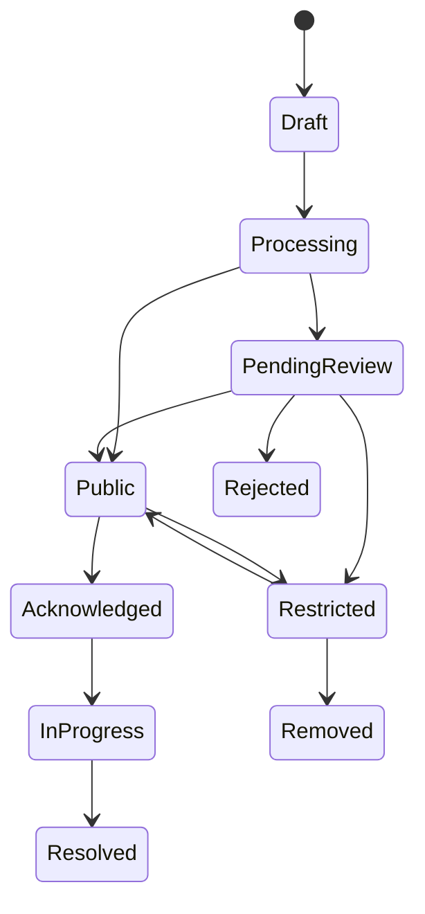

# CivicQuest Trust, Safety, Moderation & Anti-Abuse

## 1. Why this is required before launch

CivicQuest can affect real people and reputations.

Therefore:
- public visibility must be state-driven,
- original evidence must be protected,
- automated tools assist rather than determine guilt,
- report-abuse and appeal paths are required.

## 2. Report state model

## 3. Places vs Civic Catches

### Places
Can often publish after basic safety/category/location checks.

### Civic Catches
Higher risk and may require:
- stronger review,
- stricter media policy,
- face/license-plate policy,
- context checks,
- appeals.

## 4. Identity policy

Do not implement:
- face recognition,
- automatic identity lookup,
- doxxing,
- public personal-data enrichment.

The production team must decide whether public derivatives show faces, blur faces, crop subjects, or show only behavior/context.

## 5. Moderation signals

Automated assistance can flag:
- nudity/sexual content,
- violence,
- minors,
- harassment text,
- personal information,
- unsafe location,
- low-quality evidence,
- duplicate/staged content,
- manipulated-media suspicion.

## 6. Moderation priority

P0: immediate safety / illegal content / severe privacy exposure  
P1: individual accusations / minors / harassment  
P2: fake / duplicate / wrong category  
P3: routine quality correction

## 7. Abuse reports

Reasons:
- false report,
- wrong person,
- privacy violation,
- harassment,
- duplicate,
- unrelated content,
- unsafe content.

## 8. Appeals

Need appeal paths for:
- removed reports,
- affected parties,
- denied Civic Action XP.

## 9. Anti-spam

- per-session quotas,
- IP risk signals,
- device/session history,
- risk-based CAPTCHA,
- duplicate heuristics,
- rate limits,
- delayed XP for suspicious reports.

## 10. User safety

Product copy should discourage:
- confrontation,
- trespassing,
- filming in prohibited/private spaces,
- personal risk,
- staging violations.

## 11. Minors

Potential minor involvement should default to restricted visibility and moderator review.

## 12. Auditability

Moderation actions must store actor, time, prior state, new state, reason, flags, and appeal relation.

## 13. Community verification

Upvotes are an attention signal, not proof of truth.

## 14. Launch checklist

Before Civic Catches are public:
- policy approved,
- moderation queue staffed,
- appeals work,
- derivative media pipeline works,
- report-abuse works,
- sensitive categories tested.
