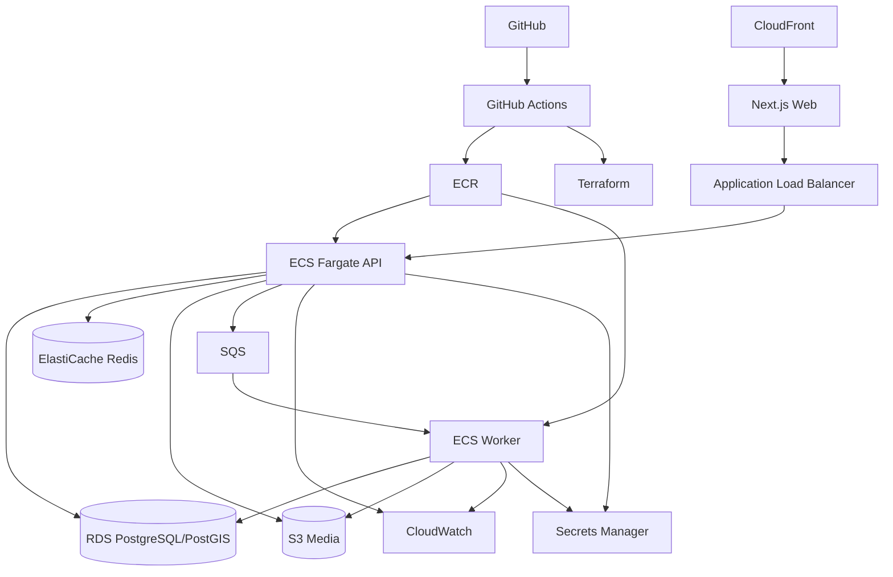

# CivicQuest Infrastructure, Deployment & CI/CD

## 1. Environments

Use:
- local
- dev
- staging
- prod

Do not use production data in non-production environments.

## 2. AWS reference architecture

## 3. Containers

Build:
- web,
- api,
- worker.

Use multi-stage builds and image scanning.

## 4. Terraform modules

- networking
- DNS/TLS
- S3/CDN
- RDS
- Redis
- ECS
- SQS
- IAM
- secrets
- monitoring

Use remote state with locking.

## 5. CI on pull requests

1. frontend lint
2. frontend typecheck
3. frontend tests
4. backend lint
5. backend type checks
6. backend tests
7. migration validation
8. dependency/security scan
9. container build
10. E2E smoke test where practical

## 6. Deployment

### Dev
Auto deploy from main.

### Staging
Controlled automatic deployment.

### Production
Manual approval or tagged release.

Sequence:
1. pre-deploy migration job,
2. API,
3. worker,
4. web,
5. smoke test.

## 7. Database migration safety

- expand/contract for breaking changes,
- do not drop fields in same release that removes usage,
- test on staging data volume,
- backup before risky migration.

## 8. Backups

RDS:
- daily backup,
- point-in-time restore.

S3:
- lifecycle policy,
- versioning if appropriate.

Infrastructure:
- Terraform in Git.

## 9. Disaster recovery

Pilot target:
- restore RDS,
- redeploy from Git/Terraform,
- rebuild Redis,
- recompute derived hotspots.

Derived state should be reproducible from source tables.

## 10. Cost controls

- small pilot instances,
- media CDN,
- storage lifecycle,
- worker concurrency caps,
- AI budget limits,
- log sampling for noisy events.

## 11. Feature flags

Use flags for:
- Civic Catch public visibility,
- specific categories,
- specific wards,
- Civic Actions,
- comments,
- account-conversion prompts.
