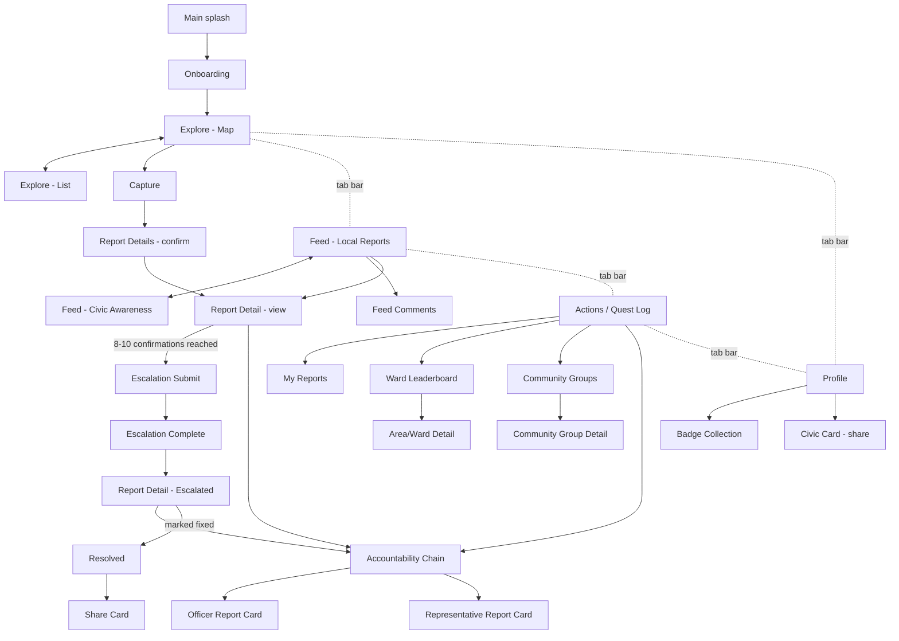

# CivicQuest — Master Product & Design Spec (Gamified Build)

**Purpose of this document:** This is a complete, implementation-ready handoff spec for the gamified version of CivicQuest — a Pokémon-GO-inspired civic issue reporting app. It covers the design system, data model, navigation, and a screen-by-screen breakdown of all **29 screens** that have been mocked up (390×844 phone frames, plus 390×694 vertical share-card frames). Give this whole file to your coding copilot as the source of truth for structure, copy, states, and visual language. A live, click-through visual reference of every screen described here exists as a published design canvas — ask the product owner (Neha) for the link if you need to eyeball pixel details instead of re-deriving them from this doc.

**How to use this doc:** Sections are ordered so a coding agent can work top-to-bottom: design tokens and components first (build the shared UI kit), then data model (build entities/API contracts), then screens in dependency order (a screen's "Navigates to" links tell you what must exist before it can be wired up fully). Every screen section lists exact copy strings — treat those as content placeholders to wire to real data, not final marketing copy to rewrite.

---

## 1. Product Concept

CivicQuest is an open-source, crowdsourced civic issue reporting app (inspired by NammaKasa/SeeClickFix-style tools) for Indian cities, reskinned with a light game layer so that reporting problems in your neighbourhood feels rewarding and is worth sharing on social media — **without** trivializing real civic accountability. Two things have to be true at once everywhere in this app:

1. **It reads as a game.** XP, levels, badges/collectibles, a friendly mascot, and severity-tiered issue markers on the map give the app a sense of progress and flex-ability (shareable "Civic Card" and ward-accountability Story cards).
2. **It stays honest and civic-grounded.** No screen may claim a number it can't explain (no invented percentages), no elected official or government worker is ever framed as a game "boss" to defeat, and the language for issue status uses plain civic terms (Reported / In Progress / Resolved, Low / Medium / High severity) rather than literal "catch a wild creature" vocabulary. The game layer is XP, levels, and badges — not a hunting metaphor.

**Core loop:** Spot an issue → Report it (photo + category + severity) → Community confirms/discusses it → Enough confirmations escalate it to an official complaint with the relevant civic authority (BMC in this Mumbai-based mock) → Track it through a transparent status chain to resolution → Earn XP/badges and optionally share a win.

**Second loop (parallel, lower-stakes):** Scroll a "Civic Awareness" feed of positive, real-world video content (cleanups, civic action) sourced from Instagram/YouTube, to normalize civic engagement the way a fitness app normalizes exercise.

**Third pillar:** Radical transparency about who is accountable for a given issue — from the ward officer up through elected representatives — with a public performance report card for each representative, including an election countdown clock.

---

## 2. Design System

### 2.1 Typography
- **Display font (headings, screen titles, big numbers/moments):** `Baloo 2`, weights 600/700/800. Rounded, friendly, game-like without being childish.
- **Body/UI font (everything else — labels, buttons, body text):** `Work Sans`, weights 400–800.
- Both loaded via Google Fonts: `family=Baloo+2:wght@600;700;800&family=Work+Sans:wght@400;500;600;700;800`.
- Screen titles are always Baloo 2, 16–20px, weight 800.
- Body copy is Work Sans, 11–14px depending on hierarchy, weight 500–700.

### 2.2 Color tokens (OKLCH — implement natively in CSS, or convert once to your platform's color format)

| Token | Value | Usage |
|---|---|---|
| `--bg` | `oklch(98% 0.004 145)` | App background (very light warm-green white) |
| `--surface` | `oklch(100% 0 0)` | Card/sheet backgrounds (pure white) |
| `--surface-2` | `oklch(95% 0.006 150)` | Secondary surface (chip backgrounds, thumbnails, segmented-control track) |
| `--ink` | `oklch(20% 0.01 250)` | Primary text |
| `--ink-soft` | `oklch(46% 0.01 250)` | Secondary text |
| `--ink-faint` | `oklch(64% 0.008 250)` | Tertiary/disabled text, inactive tab icons |
| `--line` | `oklch(88% 0.006 150)` | Borders, dividers |
| `--primary` | `oklch(52% 0.15 155)` | Brand green — CTAs, active states, "Low" severity, resolved status |
| `--primary-ink` | `oklch(36% 0.12 155)` | Text/icon color on `--primary-soft`, dark green accents |
| `--primary-soft` | `oklch(94% 0.045 152)` | Light green fill (success chips, "resolved" pills) |
| `--xp` (gold) | `oklch(80% 0.16 85)` | XP badges, level chips, gold rank medals, badge icon fill |
| `--xp-ink` | `oklch(45% 0.13 75)` | Text on `--xp-soft` |
| `--xp-soft` | `oklch(96% 0.05 85)` | XP chip background |
| `--sky` (blue) | `oklch(62% 0.14 230)` | "Medium" severity tier |
| `--sky-ink` | `oklch(40% 0.12 230)` | Text on `--sky-soft` |
| `--sky-soft` | `oklch(94% 0.03 230)` | Medium-severity chip background |
| `--rare` (purple) | `oklch(58% 0.19 300)` | "High" severity tier, badge "purple" variant |
| `--rare-ink` | `oklch(40% 0.16 300)` | Text on `--rare-soft` |
| `--rare-soft` | `oklch(94% 0.05 300)` | High-severity chip background |
| `--red` | `oklch(60% 0.15 30)` | Danger/unresolved-days counters |
| `--red-ink` | `oklch(45% 0.13 25)` | Text on `--red-soft` |
| `--red-soft` | `oklch(94% 0.035 30)` | Danger chip background |
| `--amber` | `oklch(65% 0.13 70)` | Staleness/warning callouts (e.g. "info may be outdated") |
| `--amber-ink` | `oklch(42% 0.1 75)` | Text on `--amber-soft` |
| `--amber-soft` | `oklch(95% 0.04 75)` | Warning chip background |

**Severity color mapping (used consistently everywhere severity appears):** Low = `--primary` (green), Medium = `--sky` (blue), High = `--rare` (purple). Never use red for severity — red is reserved for "days unresolved" urgency, not severity level.

### 2.3 Iconography
**Hard rule: no emoji or dingbat glyphs anywhere in the UI.** All icons are hand-drawn inline SVG, stroke-based (`stroke-width: 2.2–2.6`), `24×24` viewBox, sized 13–22px depending on context. Rank medals (1st/2nd/3rd place) are plain colored circular badges with a number inside — never medal emoji.

### 2.4 Layout conventions
- **Phone screen frame:** 390×844px (iPhone-standard portrait), `overflow:hidden`, `display:flex; flex-direction:column`.
- **Share-card (Story) frame:** 390×694px, same conventions, designed to be screenshotted/shared to Instagram Stories or WhatsApp Status.
- **Topbar pattern:** `padding: 20-22px 20px 4-6px`, back button as a 36×36px rounded-square icon button (`border-radius:10px`), screen title in Baloo 2 800, optional trailing icon button (share/menu).
- **Card pattern:** `background: var(--surface); border: 1px solid var(--line); border-radius: 14-16px; padding: 12-16px`.
- **Pill/chip pattern:** `border-radius: 100px` (fully rounded), used for status pills, tags, filter chips, XP badges.
- **Primary CTA button:** solid `--primary` background, white text, `border-radius: 12-16px`, and a **"3D game button" effect**: `box-shadow: 0 4px 0 var(--primary-ink)` (a solid drop shadow directly below, no blur) to read as a chunky, pressable game button. Smaller inline buttons use `0 3px 0`.
- **Tab bar (bottom nav):** height 84px, white surface, top border, 5 items evenly spaced: **Explore, Feed, Capture (center, elevated FAB), Actions, Profile**. The Capture tab is a raised circular FAB (52px, green, camera icon, sits 16px above the bar) with no text label of its own beyond a small "Capture" caption underneath.

### 2.5 Core reusable components

| Component | Class names (from mockups) | Description |
|---|---|---|
| **Level chip** | `.lvlchip` | Small gold pill, star icon + "Lv 12" text. Appears in headers across the app so the player's level is always visible. |
| **XP tag/badge** | `.xptag`, `.xpbadge`, `.xppreview` | Gold pill showing "+N XP" — appears on any action or content that rewards XP. |
| **XP progress bar** | `.xptrack` / inner `.xptrack i` (fill) | Rounded track + gradient gold fill bar, paired with a label row showing "current/total XP" and "Lv N+1 next". |
| **Severity tag** | `.tag.sev` / `.mtag.sev` | Colored pill: green="Low", blue/sky="Medium", purple/rare="High". |
| **Status pill** | `.status-pill` (`.reported` / `.progress` / `.resolved`) | Neutral blue = Reported, amber = In progress, green = Resolved. |
| **Auditable status checklist** | `.schain` / `.sitem` (`.done` / `.current` / `.pending`) | Vertical checklist with connecting rail line; done = filled green circle + checkmark, current = amber pulsing dot, pending = empty outlined circle, greyed label. **This replaces any kind of unexplained percentage-based progress bar** — every state shown must be a real, discrete, auditable milestone (see §4 status model). |
| **Rank medal** | `.rk.gold` / `.rk.silver` / `.rk.r1/r2/r3` | 22px circle, colored (gold/silver/bronze), plain number inside — never an emoji medal. |
| **Map pin** | `.pin` > `.glow` (blurred halo) + `.dot` (solid center) | Two-layer glow+dot marker on the map, colored by severity tier. |
| **Badge/collectible icon** | `.badge` (`.gold`/`.purple`/`.blue`) | 34–38px circle with a white-stroke icon, used in badge rows and the Badge Collection grid. |
| **Segmented control** | `.segctrl` / `.seg` (`.on`) | Two-option pill toggle (e.g. Local Reports / Civic Awareness, Map / List). |
| **Filter chip row** | `.fchip` (`.on`) | Horizontal row of pill filters, active one filled dark. |
| **3D CTA button** | `.cta` | See §2.4 — solid color + hard drop shadow. |
| **Mascot ("Sprout")** | inline SVG, `bodyGrad` gradient | Original round green blob character — no resemblance to any existing IP. Leaf antenna, two round eyes, blush cheeks, simple smile. Used on splash and onboarding only. Do not create new mascot poses without reviewing brand consistency. |

---

## 3. Information Architecture & Navigation

### 3.1 Primary tab bar (persists on: Explore, Feed, Actions, Profile; Capture is a modal/full-screen flow, not a tab destination with its own back-stack)
`Explore` · `Feed` · `Capture (FAB)` · `Actions` · `Profile`

### 3.2 Full screen inventory (29 screens, grouped exactly as laid out on the design canvas)

**Row 1 — Core flow (10 screens)**
1. Main (splash)
2. Onboarding
3. Explore (map)
4. Explore List (list view of same data)
5. Feed (Local Reports tab)
6. Civic Awareness (Feed's second tab — video scroll)
7. Feed Comments (comment thread on a Local Report)
8. Capture (camera/report-creation)
9. Report Details (confirm & submit a new report)
10. Report Detail (view an existing, not-yet-escalated issue)

**Row 2 — Escalation & Accountability, the flagship feature (6 screens)**
11. Escalation Submit (confirmation-threshold-reached + submission checklist)
12. Escalation Complete (dual-ID confirmation screen)
13. Report Detail — Escalated (the same issue's detail page, post-escalation state — richer "mini community page")
14. Accountability Chain (traces an issue to every responsible party)
15. Officer Report Card (BMC official detail + contact actions)
16. Representative Report Card (MLA/MP performance report + election clock)

**Row 3 — Quest Log & depth (10 screens)**
17. Actions ("Quest Log" hub)
18. My Reports (full list, filterable)
19. Ward Leaderboard
20. Community Groups (NGO/volunteer group directory)
21. Community Group Detail
22. Area/Ward Detail (all reports in one ward)
23. Resolved (celebratory resolution screen)
24. Share Card (share a specific resolved fix)
25. Profile (Civic Card summary + settings)
26. Badge Collection (full achievement grid)

**Row 4 — Shareable Instagram/WhatsApp Story cards (3 screens, 390×694)**
27. Help Fix My Ward (ward-level accountability flex card)
28. Before/After Story (a specific fix's before/after flex card)
29. Civic Card (personal level/XP/badges flex card)

### 3.3 High-level user journey (Mermaid)

---

## 4. Data Model (entity reference for backend/API design)

This is a conceptual model implied by the mockups — use it to shape your schema and API contracts.

### `User` (Player)
- `id`, `name`, `avatarInitial` or `avatarUrl`
- `level` (int), `xpCurrent` (int), `xpToNextLevel` (int)
- `ward` (string), `city` (string)
- `ecoPoints` / lifetime XP total ("EP" shown on Explore HUD)
- `stats`: `reportsFiled`, `assistsGiven` (confirmations on others' issues), `victories`/`resolvedCount`
- `badges`: array of `Badge.id` with `unlockedAt`
- `wardRank` (int, computed)

### `Issue` (a civic report)
- `id` (`CivicQuest Issue ID`, e.g. `CQ-MUM-002481`)
- `title`, `category` (Waste / Pothole / Streetlight / Water / Drainage / …)
- `severity`: enum `Low | Medium | High` (color-mapped per §2.2)
- `status`: enum, see §4a status model below
- `photoUrls[]`
- `location`: `{ lat, lng, address, ward, wardCode }`
- `reportedBy` (User), `reportedAt` (datetime)
- `confirmations`: count + list of confirming users ("I've Seen This" / "seen this" count is distinct from escalation-confirmations, see below)
- `escalationConfirmations`: count toward the escalation threshold (default threshold **10**)
- `escalationThresholdReached`: bool
- `officialComplaint`: nullable object, see `Complaint` below
- `department` (string, e.g. "Solid Waste Management") — derived from `category` + `ward`
- `assignedOfficer` (Officer reference)
- `daysOpen` (computed)
- `xpValue`: XP awarded to the reporter on submission, and XP awarded to the ward officer chain / community for various actions (see §6)
- `updates[]`: community update feed entries (`{ author, timestamp, message }`) — shown post-escalation
- `followers[]`: users following this issue

### `Complaint` (the official government-side record, only exists after escalation)
- `officialId` (e.g. `MCGM-29481372`) — **always store and display separately from `Issue.id`** (see §7.14 for why — this is a core product principle, not a cosmetic choice)
- `linkedIssueId`
- `submittedAt`
- `status`: `Submitted | Acknowledged | Action Pending | Resolved` (mirrors part of the Issue status chain, §4a)
- `department`, `lastCheckedAt`

### `Ward`
- `id`, `name`, `zone`, `resolutionRatePct` (must be a real computed value — see §4a, never a placeholder)
- `openIssueCount`, `resolvedThisMonthCount`
- `rankThisMonth`

### `Officer` (BMC operational staff — not elected)
- `id`, `name`/`role` (e.g. "Junior Health Inspector"), `tier` (`Ward Officer | Zone Office | Municipality`)
- `department`, `ward`
- `contactChannels`: `{ phone, whatsapp, email }`
- `source` (e.g. "BMC Civic Directory"), `lastVerifiedAt` — **required fields; never show contact info without a source and a verification date**
- `assignedAt` (per-issue relationship)

### `Representative` (elected — MLA/MP/Corporator — modeled and displayed **separately** from `Officer`, see §7.15)
- `id`, `name`, `role` (`Corporator | MLA | MP`), `constituency`
- `seatVacant`: bool
- `termStart`, `nextElectionDate`
- `performance`: `{ issuesReported, resolved, stillUnresolved, resolutionRatePct, issuesOpenOver30Days, medianResolutionDays }`
- `communityVoice`: `{ confirmationsLogged, residentsFollowingUnresolved }`
- `longestPendingIssues[]`

### `CommunityGroup` (NGO/volunteer group — user-facing label is "Community Group", never "Guild")
- `id`, `name`, `coverageArea`, `description`
- `memberCount`, `cleanupsLogged`
- `members[]`: `{ user, role (leader/member), level, reportCount }`

### `Badge`
- `id`, `name`, `description` (the unlock condition, in plain language), `tier` (`gold | purple | blue | green`), `locked` (bool)

### `CivicAwarenessPost`
- `id`, `sourcePlatform` (Instagram/YouTube), `sourceHandle`, `videoUrl` or embed reference, `durationSeconds`
- `issueCategory`, `city`, `whyItMatters` (short editorial blurb)

### 4a. The Issue status model — the single most important data contract in the app

Every issue's lifecycle is exactly these **7 discrete, auditable states**, shown as a vertical checklist (never a percentage bar — see §7.10 for the reasoning):

1. **Reported** — user submitted it
2. **Community verified** — reached the "I've seen this" / confirmation threshold for basic verification (separate, lower bar than the escalation threshold)
3. **Sent to BMC** — the escalation threshold (10 confirmations) was reached and the complaint packet was submitted
4. **Authority acknowledged** — the civic body (BMC) has acknowledged receipt (this is where `Complaint.status` starts mirroring)
5. **Action pending** — acknowledged but no resolution action logged yet
6. **Resolution verification** — marked as actioned by the authority; community confirmation of the fix is pending
7. **Resolved** — community-confirmed fix

**Rule for engineering:** never render a state as "done" unless there is a real timestamped event backing it. Never render a progress percentage for anything without a documented formula the user could ask about and get a real answer to.

---

## 5. Gamification Rules (for backend logic)

| Action | XP awarded | Notes |
|---|---|---|
| Spot/report a new issue | +5 to +15 XP depending on severity (Low +15, Medium +25, High +50 — see Capture/ReportDetails screens) | Higher severity = more XP, incentivizing reporting the issues that matter, not gaming volume |
| Confirm/"I've Seen This" on someone else's issue | +5 XP | Caps may be needed to prevent spam-confirming |
| Discuss / comment on a Civic Awareness post | +5 XP | |
| Comment on a Local Report | +5 XP | |
| Confirming a resolved fix ("Confirm it's fixed") | +5 XP | |
| Issue reaches Resolved | +25 to +50 XP to the original reporter, scaled by severity | |
| Level thresholds | Not fully specified in mocks — engineering should define an XP curve (e.g. level *N* requires `250 × N` cumulative XP) and confirm with product before hardcoding the "3,420 / 4,000 XP to Lv 13" example numbers | |
| Badges | Unlock on discrete conditions (see Badge Collection screen, §7.26, for the full list of 12 example badges and their unlock text) | |

**Escalation threshold:** 10 confirmations (shown as "8 of 10" mid-progress in mocks — configurable per issue severity/ward in production, but must always be a real integer count, never a percentage).

---

## 6. Screen-by-Screen Specification

Each entry: **Purpose → Entry points → Layout → Copy → Data → Navigates to → Notes**.

---

### Row 1 — Core Flow

#### 6.1 Main (Splash) — `Main.dc.html`
- **Purpose:** App launch/loading screen. First-run brand moment introducing the mascot.
- **Entry points:** App cold start.
- **Layout (top→bottom, centered):** Sparkle particles over a green radial-gradient background → mascot "Sprout" (glowing) → wordmark "CivicQuest" (Baloo 2, 32px) + tagline → "Meet Sprout" pill → loading bar + label near bottom.
- **Copy:**
  - Tagline: "Report issues. Level up your city."
  - Pill: "MEET SPROUT, YOUR CIVIC COMPANION"
  - Loading label: "SCANNING YOUR AREA FOR QUESTS…"
- **Data:** none (static load screen); loading bar can reflect real app-init progress.
- **Navigates to:** Onboarding (first run) or Explore (returning user, skip onboarding).
- **Notes:** Mascot is a custom SVG (round green blob, leaf antenna, white eyes with black pupils, blush cheeks) — reuse exactly, do not redesign.

#### 6.2 Onboarding — `Onboarding.dc.html`
- **Purpose:** Explain the core loop and request permissions before first use.
- **Entry points:** From Main, first run only.
- **Layout:** Top hero art panel (green gradient, mascot, sparkles) → headline → 3-step list with XP previews → 2 permission rows → primary CTA → skip link.
- **Copy:**
  - Headline: "Spot it. Report it. Level up your neighbourhood."
  - Steps: "Spot a civic issue nearby" (+5 XP) · "Report it with a photo" (+25 XP) · "Track it to resolution & earn badges" (+100 XP)
  - Permissions: **Location** — "Reveals the quest map around you"; **Notifications** — "So you never miss a level-up or badge"
  - CTA: "Start My Quest"
  - Skip: "Not now"
- **Data:** none.
- **Navigates to:** Explore (either button).

#### 6.3 Explore (Map) — `Explore.dc.html`
- **Purpose:** Primary map home screen — browse nearby issues geographically, colored by severity.
- **Entry points:** Tab bar ("Explore"), default landing tab.
- **Layout:** HUD row (player chip with avatar+level+name/city, and an "EP" (lifetime points) chip) → impact stat chips ("Resolved this month" / "Still open") → **Map/List toggle** (segmented control, defaults to Map) → map area with colored ward zones + severity-colored pins → hint text → bottom sheet showing the nearest hotspot ward + CTA → tab bar.
- **Copy:**
  - HUD: player name "Neha", city "Mumbai", level "12", EP "3,420 EP"
  - Impact chips: "1,204 / RESOLVED THIS MONTH", "340 / STILL OPEN"
  - Hint: "Tap a pin to report it · higher severity = more XP"
  - Sheet: "Subramanyanagara has 3 open issues" + "HOTSPOT" tag + CTA "Report Issue"
  - Ward labels on map show either "N% resolved" or "Needs attention" or "N open issues"
- **Data:** `Ward[]` with geo-shape + resolution rate; `Issue[]` (subset, pins) with lat/lng + severity; current `User` HUD stats.
- **Navigates to:** Explore List (toggle), Report Details/Capture (tap a pin or "Report Issue"), Area/Ward Detail (tap a ward label).
- **Notes:** Pin = glow (large, low-opacity halo) + dot (solid, white-bordered center), colored Low/Medium/High. Never use literal game-capture iconography (no poké-ball style rings).

#### 6.4 Explore List — `ExploreList.dc.html`
- **Purpose:** Non-map alternative view of the same nearby-issues data, for accessibility/preference and faster scanning.
- **Entry points:** Map/List toggle on Explore.
- **Layout:** Player chip + toggle (List active) → subtitle count → vertical list of issue rows (thumb icon colored by severity, title, ward + distance, severity tag + XP tag, chevron) → tab bar.
- **Copy:** "340 open issues near you · sorted by distance"; example rows: "Garbage dumping" (Medium, +25 XP), "Sandal Soap Factory Metro pothole" (High, +50 XP), "Broken streetlight" (Low, +15 XP), "Waterlogging near metro entrance" (Medium, +25 XP), "Overflowing dustbin" (Low, +15 XP).
- **Data:** same `Issue[]` as map, sorted by distance from user.
- **Navigates to:** Report Detail (tap a row), Map (toggle back).

#### 6.5 Feed — Local Reports tab — `Feed.dc.html`
- **Purpose:** Chronological/proximity feed of nearby reported issues for community awareness, confirmation, and discussion — the social/verification layer.
- **Entry points:** Tab bar ("Feed"), defaults to "Local Reports" segment.
- **Layout:** Header (title, level chip, filter icon) → segmented control (Local Reports / Civic Awareness) → sort note ("Sorted by distance to you") → scrollable card feed. Each card: title+distance header, star/save icon, severity+days-unresolved+XP tag row, photo, "N people have seen this" line, action row (I've Seen This / Comments count / Share), authority footer row (assigned department + status).
- **Copy (example cards):**
  1. "Garbage dumping · Dadar West", 240m away, High severity, "17 days unresolved", "+25 XP to confirm", "18 people have seen this", footer "BMC G/North · Solid Waste Management" / "UNRESOLVED"
  2. "Overflowing drain · Subramanyanagara", 410m away, Medium severity, "6 days unresolved", "+15 XP to confirm", "9 people have seen this", footer "Ward officer assigned" / "IN PROGRESS"
  3. "Pothole near school · Matunga Road", 680m away, "Resolved in 12 days", "+50 XP awarded", "72 residents confirmed the fix", actions "View Cleanup" / "Share", footer "Resolved by BMC road works" / "RESOLVED"
- **Data:** `Issue[]` feed, each with confirmation count, comment count, authority assignment.
- **Navigates to:** Civic Awareness (segment toggle), Report Detail (tap a card), Feed Comments (tap comments), Share sheet.

#### 6.6 Civic Awareness — `CivicAwareness.dc.html`
- **Purpose:** Second Feed segment — a vertical scroll of real, positive civic-behavior videos (cleanups, civic action) sourced from Instagram/YouTube, contextualized with why the issue category matters, to normalize civic engagement positively (contrast to the "problem-reporting" Local Reports feed).
- **Entry points:** Segmented control on Feed.
- **Layout:** Same header as Feed with segment set to "Civic Awareness" → large video card (source chip crediting original creator, play badge, duration badge) → info block (Issue category, City, "Why this matters" callout) → action buttons (Discuss +XP / See similar civic issues / Report a local issue) → peek strip previewing next video → tab bar.
- **Copy:** Source: "@mumbai.cleanup.crew · Instagram", duration "0:42", Issue: "Littering in public space", City: "Mumbai", Why-it-matters: "Public cleanliness and waste management directly affect neighbourhood health and flooding risk.", Buttons: "Discuss · +5 XP" / "See similar civic issues" / "Report a local issue", peek: "Next: river cleanup, Powai · scroll up".
- **Data:** `CivicAwarenessPost[]`, always crediting and linking back to the original creator/platform — **never rehost or strip attribution.**
- **Navigates to:** Feed (Local Reports), Capture (Report a local issue), a filtered issue list (See similar civic issues).
- **Legal note for engineering:** confirm rights/embedding terms per platform (Instagram oEmbed, YouTube embed) before launch; this is a licensing question, not just a UI one.

#### 6.7 Feed Comments — `FeedComments.dc.html`
- **Purpose:** Comment thread for one Local Report.
- **Entry points:** "Comments" action on a Feed card.
- **Layout:** Topbar (issue title) → days-unresolved counter card → comment count section title → comment list (avatar initial, name, message, timestamp, +5 XP tag) → bottom input bar with send button.
- **Copy:** Example thread on "Garbage dumping · Dadar West": Ritu S. "The smell is getting worse in the evening." (2 days ago) · Kabir M. "This is blocking the footpath now." (1 day ago) · Sana P. "Still here today at 8 AM." (6 hours ago) · Vikram D. "BMC truck came yesterday but only cleared half." (4 hours ago). Input placeholder: "Add what you're seeing…"
- **Data:** `Comment[]` linked to `Issue.id`; each comment grants the commenter +5 XP once.
- **Navigates to:** back to Feed / Report Detail.

#### 6.8 Capture — `Capture.dc.html`
- **Purpose:** Camera/report-creation entry point — the core "report an issue" action, reached from the FAB.
- **Entry points:** Tab bar center FAB (from anywhere), or "Report Issue"/"Report a local issue" CTAs elsewhere.
- **Layout:** Full-bleed dark camera viewfinder → top bar (close X, mode chip "REPORT MODE", flash toggle) → floating XP badge above the framing reticle → corner-bracket framing guide → tip text → category chip row (Waste/Pothole/Streetlight/Water/Drainage, one selected) → bottom bar (recent-photo thumbnail, shutter button with gold outer ring, camera-flip button).
- **Copy:** Mode chip "REPORT MODE", XP badge "+15 XP to report", tip "Center the issue and hold steady to capture it".
- **Data:** device camera/photo + selected `category`.
- **Navigates to:** Report Details (after shutter tap).
- **Notes:** No poké-ball-style capture ring — the shutter keeps a normal camera-app look with a subtle gold glow added for game flavor only.

#### 6.9 Report Details — `ReportDetails.dc.html`
- **Purpose:** Confirm/edit the details of a just-captured report before submitting.
- **Entry points:** From Capture, after taking a photo.
- **Layout:** Topbar (back, "Confirm your report", XP preview chip) → photo preview → Category chip selector → Description textarea (pre-filled/placeholder) → Location row (auto-detected, editable) → Severity selector (Low/Medium/High segmented control) → submit CTA.
- **Copy:** Title "Confirm your report", XP preview "+15 XP", description placeholder "Uncollected garbage piling up near the bus stop for over a week…", location "Shivaji Park block, Dadar West" / "Auto-detected from GPS", severity field label "Severity (how big is this issue?)", CTA "Submit Report · +15 XP".
- **Data:** creates a new `Issue` record: category, description, location (lat/lng + address), severity, photo, reportedBy, reportedAt=now, status=Reported.
- **Navigates to:** Report Detail (the new issue's own detail page).

#### 6.10 Report Detail (pre-escalation) — `ReportDetail.dc.html`
- **Purpose:** The canonical "view one issue" screen before it has been escalated to the authority — the most information-dense and important screen in the app pre-Row-2.
- **Entry points:** From Feed, Explore/Explore List, My Reports, notifications.
- **Layout (top→bottom):** Topbar (back, issue title, share) → photo → category + severity tags → meta line (ward, "Reported N days ago") → red days-unresolved counter card → **"Status" auditable checklist** (§4a, 7 states — in this pre-escalation example: Reported ✓, Community verified ✓, Sent to BMC ● current, rest pending) → "N people have seen this" card with "I've Seen This" button (+5 XP) → **Community Escalation card**: "COMMUNITY ESCALATION — 8 / 10" progress bar, explanatory line "8 nearby citizens say this still needs attention. 2 more confirmations sends it to BMC.", "Support Escalation" button → "Who's responsible?" linkrow.
- **Copy:** Example issue "Sandal Soap Factory Metro", Waste / Medium severity, "Subramanyanagara, Ward 182 · Reported 17 days ago", "17 days unresolved", "18 people have seen this" / "Nearby residents in the last 7 days" / "+5 XP for confirming", linkrow "Who's responsible?" / "Trace the accountability chain".
- **Data:** full `Issue` record incl. `escalationConfirmations` (8) vs `threshold` (10).
- **Navigates to:** Accountability Chain (linkrow), Escalation Submit (once threshold reached — button becomes active/renamed, or a confirmation sheet appears).
- **Notes:** **This is the screen where the old "Taming progress 65%" percentage bar was removed and replaced with the auditable checklist.** Never reintroduce an unexplained percentage anywhere in this screen or its escalated variant.

---

### Row 2 — Escalation & Accountability (flagship feature — build this row with the most care)

#### 6.11 Escalation Submit — `EscalationSubmit.dc.html`
- **Purpose:** The moment the community confirmation threshold is reached and the app packages the issue into an official complaint. This is one of the app's signature interactions.
- **Entry points:** "Support Escalation" on Report Detail, once the 10th confirmation lands (could be the user's own tap, or a background trigger if someone else's confirmation crosses the threshold — either way the user who initiates escalation sees this screen).
- **Layout:** Topbar ("Escalating to BMC") → green "Community threshold reached" banner (checkmark, "10 residents have confirmed this issue.", "Ready to send to: BMC G/North Ward — Solid Waste Management Department") → complaint packet summary card (CivicQuest Issue ID + full field list) → attached-evidence checklist (all checked) → "Sending to BMC…" status row with spinner.
- **Copy — complaint packet fields (exact labels):** CivicQuest Issue `CQ-MUM-002481`, Category "Garbage dumping", Severity "High", Location "Shivaji Park, Dadar West", Ward "G/North", Department "Solid Waste Mgmt.", First reported "Sep 11, 2026", Still present "Sep 13, 2026", Community confirmations "18 residents". Checklist: "Location attached" / "Photo attached" / "Ward identified" / "Department identified" / "Community evidence attached". Footer: "Sending to BMC…"
- **Data:** reads the full `Issue` record; on completion, creates the linked `Complaint` record with a real government-side ID (see integration note below).
- **Navigates to:** Escalation Complete (automatically, after the "sending" step resolves).
- **Integration note for engineering:** in production this screen represents a real API call to whatever municipal complaint intake system is available (BMC's public grievance portal / RTI-style API, or a manual queue if no API exists). If no direct integration exists at launch, this can submit via email/webhook to a monitored inbox and a human-in-the-loop assigns the official ID — the UI doesn't need to know which, but the backend contract (`Complaint.officialId` arrives asynchronously) should be designed for either.

#### 6.12 Escalation Complete — `EscalationComplete.dc.html`
- **Purpose:** Confirms the escalation succeeded and gives the user the two IDs they now own a stake in.
- **Entry points:** Automatically after Escalation Submit.
- **Layout:** Centered success checkmark icon → title "Complaint escalated" → ID card: **Official BMC Complaint ID** (large, primary-colored) then a divider then **CivicQuest Issue ID** (secondary) then a divider then submitted timestamp then a "N residents following" pill → explanatory line about deduplication → primary CTA "Track Complaint" + secondary "Share to WhatsApp".
- **Copy:** "Complaint escalated", "OFFICIAL BMC COMPLAINT ID" `MCGM-29481372`, "CIVICQUEST ISSUE ID" `CQ-MUM-002481`, "Submitted" "13 Sep · 10:42 AM", "18 residents following", body copy: "Everyone who follows this issue now tracks one official complaint — instead of filing duplicates."
- **Data:** `Complaint.officialId`, `Complaint.submittedAt`, `Issue.followers.length`.
- **Navigates to:** Report Detail — Escalated (Track Complaint), WhatsApp share sheet (Share to WhatsApp — see §6.28 pattern for the message template).

#### 6.13 Report Detail — Escalated — `ReportDetailEscalated.dc.html`
- **Purpose:** The **post-escalation state of the same issue detail page** (6.10) — now a richer "mini community page" instead of a plain report.
- **Entry points:** "Track Complaint" from Escalation Complete; re-opening any escalated issue from Feed/My Reports/notifications thereafter.
- **Layout:** Topbar (back, issue title, share) → subtitle location line → severity + "days open" tags → photo → "N people confirmed this" avatar row → **Official Complaint card**: label + status pill ("Acknowledged"), `BMC #MCGM-29481372` (bold), department + "Last checked" timestamp, **mini 4-step chain** (Reported/Escalated/Ack'd/Action Pending — dots filled up to current state), two buttons "Track Official Complaint" / "Share" → **Community card**: 3-stat row (Following / Confirmed / Updates) + two buttons "Follow" / "Add Update" → "Latest Community Updates" section title + timestamped update entries → bottom 3-button action row: "Confirm Still There" / "Add Update" / "Share".
- **Copy:** Title "Garbage dumping", "Shivaji Park, Dadar West · G/North Ward", "High severity" / "17 days open", "23 people confirmed this", Official Complaint: `BMC #MCGM-29481372`, "Acknowledged", "Solid Waste Management · Last checked today, 8:20 AM", mini-chain labels "Reported / Sep 11", "Escalated / Sep 13", "Ack'd / Sep 14", "Action / Pending". Community: "18 Following", "23 Confirmed", "4 Updates". Updates: "Today · 8:00 AM — Still present." / "Yesterday · 6:30 PM — BMC truck visited but garbage remains."
- **Data:** `Issue` + linked `Complaint` + `Issue.updates[]` + `Issue.followers`.
- **Navigates to:** Accountability Chain, Resolved (once the community/authority marks it fixed), Share sheet.
- **Notes:** This is the single most content-rich screen in the app — treat it as the canonical "issue permalink" page (`civicquest.app/i/CQ-MUM-002481` per the WhatsApp share template in §6.28).

#### 6.14 Accountability Chain — `Accountability.dc.html`
- **Purpose:** Traces exactly who is responsible for a given issue, from raw coordinates up to the municipality, with elected representatives shown as a **visually and conceptually separate** track since they are not part of the BMC operational chain.
- **Entry points:** "Who's responsible?" linkrow on Report Detail / Report Detail Escalated; "Who's responsible for your ward?" bar on Actions.
- **Layout:** Topbar ("Accountability Chain") → subtitle (issue name + ward) → **geographic trace card**: 3 rows connected by a small down-arrow — "Issue coordinates" → value, "Municipal ward" → value, "Responsible dept." → value → section title "Operational chain · BMC" → tappable officer rows (avatar initials, role, tier context, chevron) → a non-tappable **Municipality** summary row (grey background, no chevron — it's an institution, not a person) → section title "Elected representation" → **visually distinct container** (tinted background + an explicit note: "Political representation — not part of the BMC operational chain above") containing Corporator (may be vacant) and MLA rows → linkrow to the MLA's full report card.
- **Copy:** Subtitle "Sandal Soap Factory Metro · Subramanyanagara, Ward 182". Trace: "Issue coordinates" `19.0268, 72.8382`, "Municipal ward" `G/North · Ward 182`, "Responsible dept." `Solid Waste Mgmt.`. Officer chain: "Junior Health Inspector" / "Ward officer · assigned 5 days ago"; "Additional Commissioner" / "Zone office · escalated 2 days ago"; Municipality row "Municipal Corporation of Greater Mumbai" / "Municipality · oversees all zones". Elected: "Corporator" / "Seat vacant since 2020" (shown at reduced opacity when vacant); "A. C. Srinivasa" / "MLA · Constituency office". Linkrow: "View A. C. Srinivasa's report card" / "Reports, pending time & action rate".
- **Data:** `Issue.location`, `Issue.department`, chain of `Officer` records by tier, plus the ward's `Representative` records (Corporator + MLA, and MP if applicable — not shown in this example but should be supported).
- **Navigates to:** Officer Report Card (tap any BMC officer row), Representative Report Card (tap MLA/linkrow).
- **Product principle — do not violate:** never render an elected official as a "boss" to "defeat" or use adversarial/combat framing anywhere in this screen or its children. Use respectful, factual "tier"/"chain" language only.

#### 6.15 Officer Report Card — `OfficerReportCard.dc.html`
- **Purpose:** Detail + contact screen for one BMC official in the operational chain.
- **Entry points:** Tapping any officer row on Accountability Chain.
- **Layout:** Topbar ("Officer profile") → head card (avatar initials, role, department/ward) → info list: **Why this person?** (the issue+ward that connected them), **Source** (directory attribution), **Last verified** (date), **Assigned** (relative date) → amber staleness-flag callout (crowd-sourced-data disclaimer) → "Contact" section title → 2×2 action button grid: **Call / WhatsApp / Email / Official complaint** (last one is the primary/filled button) → bottom link back to the Accountability Chain.
- **Copy:** "Junior Health Inspector" / "Ward sanitation · G/North Ward, BMC". Info rows: "Why this person?" → "Waste complaint · Ward 182"; "Source" → "BMC Civic Directory"; "Last verified" → "Sep 2026"; "Assigned" → "5 days ago". Staleness flag: "Directory info is community-sourced — flag if this contact is outdated". Bottom link: "View this issue's accountability chain".
- **Data:** `Officer` record + which `Issue` triggered the navigation (for "Why this person?").
- **Navigates to:** device dialer (Call), WhatsApp deep link (WhatsApp), mail client (Email), a complaint-filing flow (Official complaint — likely reuses/extends the Escalation flow), back to Accountability Chain.
- **Notes:** every field here (`Source`, `Last verified`) is a **required, non-optional** UI element — this screen must never show contact info without provenance and a recency signal, since directory data about real government staff can go stale and the app must let users flag that.

#that#### 6.16 Representative Report Card — `RepReportCard.dc.html`
*(section numbering note: this is 6.16)*
- **Purpose:** A dignified, data-driven public performance report for one elected representative (MLA in this example — MP/Corporator use the same template). Deliberately **not gamified** — no XP, no playful language — this is real electoral accountability data.
- **Entry points:** Linkrow from Accountability Chain.
- **Layout:** Topbar ("Representative report card") → head card (avatar, name, role+constituency) → **Election Accountability Clock** (dark green card): label with clock icon, a horizontal term-timeline (track with a filled progress-to-today segment, a "TODAY" marker dot+label, year labels for term-start and next-election at each end), and a big "N years N months remaining" line → **Civic performance this term** card: 2×2 stat grid (Issues reported / Resolved / Still unresolved / Resolution rate) + an amber callout for issues stuck >30 days → **Community voice** card: 2-stat row (confirmations logged / residents following unresolved cases) + a median-time-to-resolution row → "Longest-pending in this constituency" list (2+ example rows: issue title, category+ward, days-pending in red).
- **Copy:** "A. C. Srinivasa" / "MLA · Rajarajeshwari Nagar constituency". Clock: "Election accountability clock", timeline year labels "Term start · 2024" / "Next election · 2029", "2 years 4 months remaining" / "until the next assembly election". Performance grid: `1,248` Issues reported, `486` Resolved, `762` Still unresolved, `39%` Resolution rate; callout "143 issues open more than 30 days". Community voice: `8,420` confirmations logged, `1,280` residents following unresolved cases; "Median time to resolution" → `18 days`. Longest-pending: "Illegal dumping, Uttarahalli main road" (Waste · Ward 174, 61 days), "Broken storm drain cover" (Drainage · Ward 176, 54 days).
- **Data:** full `Representative` record as modeled in §4.
- **Navigates to:** back to Accountability Chain (or wherever it was entered from).
- **Notes:** This screen's numbers must be sourced from real public records in production (election commission data, RTI responses, or the aggregate of CivicQuest's own issue data for that constituency) — never fabricated. The "39%" resolution rate etc. are illustrative placeholders in the mock.

---

### Row 3 — Quest Log & Depth

#### 6.17 Actions ("Quest Log") — `Actions.dc.html`
- **Purpose:** Personal hub — a dashboard rolling up your own reports, your ward's standing, and nearby community groups.
- **Entry points:** Tab bar ("Actions").
- **Layout:** Header (title "Quest Log", subtitle, level chip top-right) → **My Reports** section (3 example rows with status pills + "See all") → **Ward Leaderboard** section (2 example rows with rank medal + resolution %) → **Community Groups Nearby** section (1 example row) → accountability CTA bar ("Who's responsible for your ward?") → tab bar.
- **Copy:** Title "Quest Log", subtitle "Your reports, ward rank & community groups nearby". My Reports rows: "Uncollected garbage" (Reported), "Broken streetlight" (In progress), "Pothole near school" (Resolved +50 XP). Ward Leaderboard: "Shivaji Park" 85% (rank 1, gold), "Subramanyanagara · your ward" 79% (rank 2, silver). Community Groups: "Shivaji Park Cleanup Collective" · 34 members · covers your area. Bottom bar: "Who's responsible for your ward?" / "Officer, utility & elected reps".
- **Data:** current user's `Issue[]` (owned), ward leaderboard slice, nearby `CommunityGroup[]`.
- **Navigates to:** My Reports (See all), Ward Leaderboard (See all), Community Groups (See all), Community Group Detail (tap row), Accountability Chain (bottom bar — ward-level, not issue-specific, so should show the ward's default/most-relevant open issue or a ward-summary variant).

#### 6.18 My Reports — `MyReports.dc.html`
- **Purpose:** Full filterable list of the current user's own reports.
- **Entry points:** "See all" on Actions → My Reports.
- **Layout:** Topbar ("My Reports") → filter chip row (All (9) / Reported / In progress / Resolved) → card list (thumb, title, ward+date, status pill).
- **Copy:** rows — "Uncollected garbage" (Shivaji Park block, 2 days ago, Reported); "Broken streetlight" (Mahim Junction, 6 days ago, In progress); "Pothole near school" (Matunga Road, 12 days ago, Resolved · +50 XP); "Water pipe leakage" (Dadar West, 18 days ago, Resolved · +25 XP); "Overflowing drain" (Subramanyanagara, 6 days ago, In progress).
- **Data:** `Issue[]` where `reportedBy == currentUser`.
- **Navigates to:** Report Detail / Report Detail Escalated (tap a row, depending on state).

#### 6.19 Ward Leaderboard — `WardRanking.dc.html`
- **Purpose:** City-wide ranking of wards by resolution performance.
- **Entry points:** "See all" on Actions → Ward Leaderboard.
- **Layout:** Topbar ("Ward Leaderboard") → subtitle → 2 summary stats (wards tracked, city resolution rate) → table header row → ranked rows (medal, ward name + fraction resolved, % + trend arrow, current-user's ward highlighted).
- **Copy:** Subtitle "Which ward is levelling up fastest?". Stats: `227` Wards tracked, `64%` City resolution rate. Rows: 1. Shivaji Park 142/168 → 85% (+4%); 2. Subramanyanagara (your ward, highlighted) 96/121 → 79% (+2%); 3. Matunga 88/119 → 74% (+1%); 4. Mahim 71/108 → 66% (−3%); 5. Dadar West 63/102 → 62% (−1%).
- **Data:** `Ward[]` ranked by `resolutionRatePct`, with week-over-week trend.
- **Navigates to:** Area/Ward Detail (tap a row).

#### 6.20 Community Groups — `NGOs.dc.html`
- **Purpose:** Directory of NGOs/volunteer groups a user can join.
- **Entry points:** "See all" on Actions → Community Groups.
- **Layout:** Topbar ("Community Groups") → subtitle → card list (mark icon, name, coverage area, description, member+cleanup-count meta, chevron) → dashed "start your own" CTA strip.
- **Copy:** Subtitle "Team up with NGOs & volunteer groups active in Mumbai". Cards: "Shivaji Park Cleanup Collective" (Shivaji Park & Dadar West, weekly cleanup drives + school programs, 34 members · 61 cleanups logged); "Matunga Cleanup Crew" (Matunga & King's Circle, drainage/storm-water focus, 21 members · 29 cleanups logged); "Mahim Bay Watch" (Mahim & Bandra East, coastal/creek cleanup, works with ward sanitation office, 18 members · 22 cleanups logged). CTA: "Start your own group?"
- **Data:** `CommunityGroup[]`.
- **Navigates to:** Community Group Detail (tap a card), a group-creation flow (CTA strip — not yet designed, flag as a gap).

#### 6.21 Community Group Detail — `NGODetail.dc.html`
- **Purpose:** One group's profile, stats, and member leaderboard.
- **Entry points:** Tap a card on Community Groups.
- **Layout:** Topbar ("Group profile") → head card (mark icon, name, coverage, description, "Join this group" 3D button) → 3-stat row (Members / Cleanups logged / Issues resolved) → "Members & contributions" list (avatar, name, role/tenure + level, report count).
- **Copy:** "Shivaji Park Cleanup Collective" / "Covers Shivaji Park & Dadar West" / "A volunteer-run group organizing weekend cleanup drives and school awareness programs since 2022." Stats: `34` Members, `61` Cleanups logged, `89` Issues resolved. Members: Priya Menon (Group leader · Lv 24, 18 reports), Rahul Iyer (Member since 2022 · Lv 19, 14 reports), Aditi Shah (Member since 2023 · Lv 15, 11 reports), Sameer Khan (Member since 2023 · Lv 12, 9 reports), "+30 Other members" (See full list).
- **Data:** `CommunityGroup` + `members[]`.
- **Navigates to:** join flow (not yet designed — flag as a gap), a full member list (not yet designed).

#### 6.22 Area/Ward Detail — `AreaDetail.dc.html`
- **Purpose:** All issues within one ward, filterable by status.
- **Entry points:** Tap a ward on Explore map, or a ward row on Ward Leaderboard.
- **Layout:** Topbar (ward name) → hotspot banner (issue-count badge, "Hotspot this week" + "Highest issue density in Ward 182") → 3-stat row (Open / In progress / Resolved) → filter chips (All (35) / Open / In progress / Resolved) → issue card list (severity-colored thumb, title, category+severity+age, status/XP pill).
- **Copy:** Ward "Subramanyanagara". Banner: "3" badge, "Hotspot this week" / "Highest issue density in Ward 182". Stats: `12` Open, `5` In progress, `18` Resolved. Rows: "Sandal Soap Factory Metro" (Waste · Medium · 6 days ago, "In progress"); "Overflowing drain" (Drainage · Low · 3 days ago, "+15 XP if resolved"); "Broken footpath tile" (Roads · Low · 9 days ago, "+15 XP if resolved"); "Streetlight not working" (Utilities · High · resolved!, "+50 XP earned").
- **Data:** `Issue[]` filtered by `ward`.
- **Navigates to:** Report Detail (tap a row).

#### 6.23 Resolved — `Resolved.dc.html`
- **Purpose:** Celebratory screen shown when an issue is marked resolved.
- **Entry points:** From Report Detail Escalated once a resolution is logged, or a push notification.
- **Layout:** Topbar (issue title, share icon) → green gradient "victory" banner (star icon, "Resolved!" headline, "+50 XP earned" pill) → "Marked resolved by Ward Officer" status pill → before/after photo comparison (2 panes, labeled) → meta line (resolved date, days-to-resolve) → confirmation card ("N nearby residents confirmed this is fixed", avatar stack, "Confirm it's fixed · +5 XP" button).
- **Copy:** "Resolved!", "+50 XP earned", "Marked resolved by Ward Officer", "Resolved on 18 Sep · 12 days after it was reported", "8 nearby residents confirmed this is fixed" / "Anyone in Subramanyanagara can verify" / "Confirm it's fixed · +5 XP".
- **Data:** `Issue` at status=Resolved, before/after photo pair.
- **Navigates to:** Share Card (share icon).

#### 6.24 Share Card — `ShareCard.dc.html`
- **Purpose:** Generic share sheet for a resolved fix (distinct from the dedicated Before/After Story card in Row 4 — this is the in-app share sheet; that is the exported Story image).
- **Entry points:** Share icon on Resolved.
- **Layout:** Topbar ("Share this fix", close X) → preview card (brand mark, status "Resolved in 12 days · +50 XP", before/after mini-panes, title+location+verification line) → share-channel row (WhatsApp / Instagram / More) → primary CTA "Share to WhatsApp".
- **Copy:** "Resolved in 12 days · +50 XP", "Sandal Soap Factory Metro", "Subramanyanagara, Ward 182 · Verified by 8 residents".
- **Data:** rendered from the `Issue`'s resolved state — this preview card should be generated as an actual shareable image server-side or client-side (not just an in-app mock).
- **Navigates to:** native share sheet / WhatsApp / Instagram.

#### 6.25 Profile — `Profile.dc.html`
- **Purpose:** Personal hub — Civic Card summary + app settings.
- **Entry points:** Tab bar ("Profile").
- **Layout:** **Civic Card summary panel** (dark green gradient card): avatar with level badge, name+location, XP progress bar (current/next-level label), badge-preview row (3 badges + "+N more") → 3-stat row (Reports filed / Assists / Victories) → "Share My Civic Card" outlined button → Settings list (Notifications, Language, Help & Support, About CivicQuest, Log out) → tab bar.
- **Copy:** "Neha D." / "Dadar West · Mumbai", XP row "3,420 / 4,000 XP" / "Lv 13 next", stats `9` Reports filed, `31` Assists, `6` Victories. Settings rows: "Notifications", "Language" (English), "Help & Support", "About CivicQuest", "Log out" (red).
- **Data:** full current `User` record.
- **Navigates to:** Badge Collection (tap the "+N more" badge preview), Civic Card share screen (Share My Civic Card button), each settings row's own (unspecified) sub-screen.

#### 6.26 Badge Collection — `BadgeCollection.dc.html`
- **Purpose:** Full achievement/collectibles grid.
- **Entry points:** "+N more" on Profile's badge row.
- **Layout:** Topbar ("Badges", share icon) → summary row (N/Total unlocked, total XP) → filter tabs (All / Low / Medium / High) → 3-column grid of badge cells (icon circle, name, unlock-condition caption; locked cells shown greyed with a lock icon).
- **Copy — all 12 badges (name / unlock condition):**
  1. First Report — "Reported your 1st issue" (gold)
  2. Streak Keeper — "7-day report streak" (green, checkmark icon)
  3. Zone Scout — "Explored 5 wards" (blue)
  4. High-Impact Hunter — "Resolved 10 high-severity issues" (purple)
  5. Community Joiner — "Joined your 1st community group" (green)
  6. Neighbourhood Hero — "50 reports in one ward" (gold)
  7. Early Bird — "10 reports before 8am" (blue)
  8. Level 10 — "Reached level 10" (purple)
  9. First Assist — "Confirmed a nearby report" (green)
  10. **[locked]** Ward Champion — "Rank #1 in your ward"
  11. **[locked]** Critical Fix — "Resolve a critical issue"
  12. **[locked]** Century Club — "100 total reports"
  - Summary: "12 / 24 Collectibles unlocked", "3,420 Total XP" (the 24 total implies more badges exist beyond these 12 examples — engineering should treat the badge list as extensible/config-driven, not hardcoded to 12).
- **Data:** `Badge[]` with `locked` state per current user.
- **Navigates to:** none further (leaf screen).

---

### Row 4 — Shareable Story Cards (390×694, designed to be screenshotted or exported as an image for Instagram Stories / WhatsApp Status)

#### 6.27 Help Fix My Ward — `HelpFixWard.dc.html`
- **Purpose:** Ward-level accountability flex/awareness card — "look how much work my ward needs" or "look how active my ward is", shareable to recruit attention/participation.
- **Entry points:** Share action from Area/Ward Detail or Ward Leaderboard (exact trigger point not fully wired in mocks — treat as a share action available from any ward-context screen).
- **Layout:** Brand row → eyebrow + big headline (ward name) + sub-ward list → 2 stat rows (dark translucent cards) → 2 tag chips (a status badge + a "Hotspot" tag) → gold XP tag (community-wide XP stat) → spacer → white CTA button → footer tagline.
- **Copy:** Eyebrow "HELP FIX MY WARD", Headline "G/North Ward, Mumbai", sub-list "Dadar West · Mahim · Shivaji Park". Stats: `47` "issues still open", `12` "resolved by residents this week". Tags: "Needs attention", "Hotspot". XP tag: "+2,150 community XP this week". CTA: "See issues near you". Footer: "Join the movement · civicquest.app".
- **Data:** `Ward` aggregate stats.
- **Navigates to:** (as an exported image, taps would deep-link back into the app to Area/Ward Detail).

#### 6.28 Before/After Story — `BeforeAfterStory.dc.html`
- **Purpose:** A specific fix's before/after flex card.
- **Entry points:** Share flow from a Resolved issue.
- **Layout:** Brand row → eyebrow "Before / After cleanup" + headline → side-by-side before/after photo panes (labeled) → area line → 2-stat row (citizens confirmed / days-to-fix) → CTA → footer.
- **Copy:** Headline "A pothole finally got fixed.", area "Dadar West, Mumbai", stats `72` "citizens confirmed", `12 days` "fixed in", CTA "View impact on CivicQuest", footer "See the cleanup story · civicquest.app".
- **Data:** one resolved `Issue`'s before/after photos + confirmation count + resolution time.

#### 6.29 Civic Card — `CivicCard.dc.html`
- **Purpose:** Personal flex card — level, XP, badges, ward rank — the "look at my stats" share format, the direct answer to "how do I flex my points on Instagram".
- **Entry points:** "Share My Civic Card" button on Profile.
- **Layout:** Brand row → avatar+level badge + name headline ("Neha's Civic Card") + location → XP progress bar (current/next-level label) → 3-stat row (Resolved / Assists / Badges) → "Collectibles unlocked" section label + 3 badge icons + "+N more" → ward-rank pill → spacer → white CTA → footer tagline.
- **Copy:** "Neha's Civic Card" / "Dadar West · Mumbai". XP row "3,420 / 4,000 XP" / "Lv 13 next". Stats: `47` Resolved, `31` Assists, `12` Badges. Rank pill: "#4 in Dadar West this month". CTA: "Start your own quest". Footer: "Level up your neighbourhood · civicquest.app".
- **Data:** current `User` full stat block.

---

## 7. Cross-Cutting Product Principles (do not regress on these)

1. **No unexplained numbers.** Every percentage, score, or stat shown to a user must be backed by a real, describable calculation. If a number can't be explained on request, don't show it (this is why the old "Taming progress 65%" bar was replaced with the 7-state auditable checklist in §4a).
2. **Civic-grounded vocabulary.** Use: Open/Reported, In progress, Resolved, Low/Medium/High severity, Community Group. Avoid: "catch/caught", "wild issue", "taming", "rarity", "guild", "rare zone", "trainer card" — these read as literal Pokémon-hunting language and undercut the app's credibility as a real civic tool. XP, levels, and badges are the game layer; hunting-verbs are not.
3. **Elected officials are never adversaries.** No "boss battle" framing, no combat language, anywhere the app shows an MLA/MP/Corporator or their performance data. Use respectful, factual, tiered/chain language.
4. **Operational accountability (BMC staff) and political accountability (elected reps) are modeled and displayed as separate hierarchies**, even though both appear on the same Accountability Chain screen — because MLAs/MPs do not report through the BMC operational chain, and conflating them mischaracterizes how Indian municipal governance actually works.
5. **Two IDs, always, once escalated.** `Issue.id` (CivicQuest-side, exists before/after any government involvement) and `Complaint.officialId` (government-side, exists only after escalation) must never be merged into one field — this is what lets the app act as a durable community layer around a complaint that a government system might archive or renumber.
6. **One complaint, many followers — never duplicate escalations.** Before letting a user escalate, check whether the issue already has a `Complaint` — if so, route them to follow the existing one instead of filing a second.
7. **No emoji/dingbat icons anywhere** — inline SVG only, per §2.3.
8. **Directory data about real people (BMC officers) always carries a `Source` and `Last verified` date and a way to flag it as stale** — see Officer Report Card (§6.15).

---

## 8. Known Gaps / Open Questions for Engineering + Product to resolve before build

- **XP curve / leveling formula** is not fully specified — the mocks show example numbers ("3,420 / 4,000 XP to Lv 13") but no formula. Needs product sign-off (see §5).
- **Escalation threshold** (10 confirmations in mocks) — should this scale by severity, ward population, or stay fixed? Not decided.
- **Real municipal complaint integration** — no confirmed API exists yet for BMC (or whichever city); Escalation Submit's backend needs a defined integration path (see §6.11 integration note) before this can go beyond a mock.
- **Officer/Representative directory sourcing** — needs a real, maintained data source (community-editable with moderation, or licensed civic-data feed) since this is the app's credibility backbone.
- **Civic Awareness content rights** — needs legal review of Instagram/YouTube embedding + attribution terms per §6.6.
- **Community Group creation flow** — "Start your own group?" CTA on Community Groups (§6.20) has no destination screen yet.
- **Settings sub-screens** on Profile (Notifications, Language, Help & Support, About) are unspecified beyond the row itself.
- **Badge catalog beyond the 12 examples** — Badge Collection implies 24 total; the full list needs defining.
- **Share-card image generation** — Row 4 screens and the Share Card screen (§6.24) need a real rendering pipeline (server-side image generation or client-side canvas export) to produce an actual shareable image file, not just an in-app preview.

---

*End of spec. 29 screens covered across 4 rows: Core Flow (10), Escalation & Accountability (6), Quest Log & Depth (10), Shareable Story Cards (3).*
